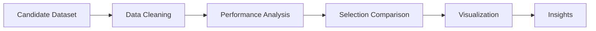

# 🎯 Internship Selection Analysis


A data analysis project focused on understanding internship selection trends, candidate performance, and hiring criteria using Python and exploratory data analysis.

---

## Project Overview

This project analyzes candidate data to identify factors affecting internship selection decisions.

Key objectives:

- Analyze candidate performance
- Compare selected vs rejected candidates
- Study CGPA and skill trends
- Explore project and GitHub score impact
- Visualize recruitment insights

---

## Tech Stack

- Python
- Pandas
- NumPy
- Matplotlib
- Seaborn
- Jupyter Notebook

---

## Project Structure

```md
Internship-Selection-Analysis/
│
├── data/
│ ├── internship_candidates.csv
│ └── cleaned_dataset.csv
│
├── notebook/
│ └── internship_analysis.ipynb
│
└── README.md
```

---

## Analysis Workflow



---

## Key Analysis Performed

- Selection rate analysis
- CGPA comparison
- Skill distribution analysis
- GitHub/project score analysis
- Candidate performance trends

---

## Output

Prepared insights useful for:
- Recruitment analytics
- Candidate evaluation
- Internship trend analysis
- Hiring dashboards

---

## Future Improvements

- Machine learning prediction model
- Candidate recommendation system
- Interactive dashboard creation

---

## Report

This project is created only for educational and analytical purposes.  
Plagiarism is strictly prohibited.

---

⭐ If you found this project helpful, consider giving it a star!
